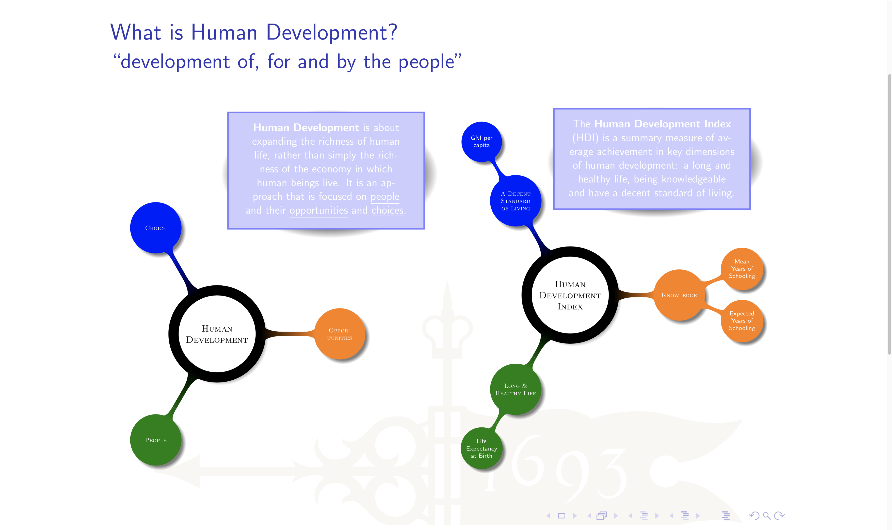
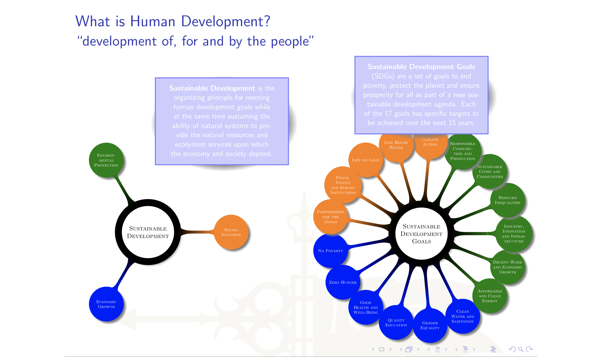

# Assignment 1
Write an Annotated Bibliography

## Summary
In this assignment you will begin your exploratory investigation into a geospatial human development process.  You will propose a research topic and select a region or country to begin your exploratory investigation into a dimension of human development.  Then you will need to research and select five articles that use geospatial data to answer a scientific question about human development. Once you have identified your articles, annotate each one, by identifying the most important ideas that have been addressed in the work as well as by answering a series of questions about the intersection of each source with the main themes of this course.  Through the development of these annotations you will begin to establish a boundary for your research while describing and defining the landscape of knowledge that populates your selected area of investigation. Your annotated bibliography is the starting point for describing the problem you will investigate in terms of harms, significance, and inherency, as well as a means for clarifying the parameters of your inquiry.

## Instructions
Begin by reviewing the United Nations knowledge platform on the [Sustainable Development Goals](https://sustainabledevelopment.un.org).  Consider your interests and think about a research area, which is mostly likely to intersect with one or more of the SDGs.  Contemplate the research topic you would like to investigate this semester. Select a topic that includes the use of data science methods that describe, analyze, model and/or simulate a geospatial human development pattern and/or process.  Following are some suggested human development topics where data science methods are being actively developed.
  - Disaster management and response
  - Socioeconomic Analysis
  - Precision Epidemiology and disease burdern estimation
  - Migration
  - Urbanization
  - Infrastructure and social service
  - Accessibility modeling
  - Transportation modeling
  - Poverty assessment and analysis
  - Resource management and allocation
  - Food security
  - Environmental Impact Assessment
  - Climate change
  - Land use
  
[Making an appointment with a research librarian at Swem](https://libraries.wm.edu/appointments) in order to receive assistance and individual attention is a good place to start.  Be sure to share your assignment with your research librarian in advance of meeting, so she/he will be best prepared at the time you meet.

Publications made available on the [Flowminder](https://web.flowminder.org/work/research-innovation) and [WorldPop]( https://www.worldpop.org/publications) websites are both good places to start with your investigation.  After selecting your five articles, annotate each one, by identifying and describing the most important ideas presented in each work.  Identify and describe the significant harm (development problem) each article is seeking to address.  Also identify and describe the inherent and complex nature of the development problem as it pertains to the region or country of investigation.  Additionally, answer the following questions.
  - How does this article relate to Amartya Sen’s definition of human development?
  - Which dimension of human development is being addressed by the authors’ research?
  - Which sustainable development goals can be considered in relation to your selected article?
  - Which (geospatial) datasets are used by the authors?
  - Which (geospatial) data science methods are used by the authors?
  - Which human development pattern or process are the authors investigating?
  - What is the scientific question the authors are seeking to answer?

After selecting a research topic and annotating each source, write a one paragraph problem statement that identifies the harms you are seeking to address, quantifies the significance of those harms and describes the inherent and complex nature of the problem.  Contextualize your problem statement within its regional or country specific locale.  Include a description of the local nature and complex challenges associated with your selected human development problem within the context of your selected region, countries or country.

## Deliverable
Type your annotated bibliography.  Your annotated bibliography should be at least 2000 words in length and include a minimum of five different sources. Title your annotated bibliography and be sure to include your name.  Do not include your title or reference information when calculating your word count. Please post your annotated bibliography to your github site and share a link to your published webpage on slack channel [#data150_assignment1](https://wmdsi.slack.com/archives/CTFA0R00Y) no later than 10PM, Saturday, February 22nd.

