# Getting started with GitHub

Through the course of this semester you will use GitHub as a repository to save and share your work.  GitHub uses a fairly simple programming language called markdown which you will use to present content you have created.  Upon completing your different GitHub sites, I will ask you to post a link to your website on the appropriate slack channel \#data1X0\_ prior to the given deadline.

To begin go to [https://github.com](https://github.com) and create a new account.  You should see a website that is very similar to the following image.

After clicking on the sign up link, create your account by designating your username, e-mail address and password.  In order to simulate the process of signing up, I am using the username `wicked-problems.`  My real GitHub account is [https://github.com/tyler-frazier](https://github.com/tyler-frazier), and you are welcome to follow me, although it is not necessary for this final project.

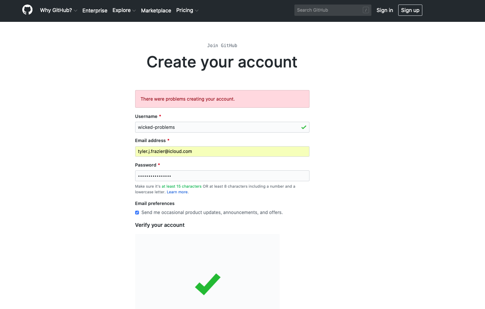

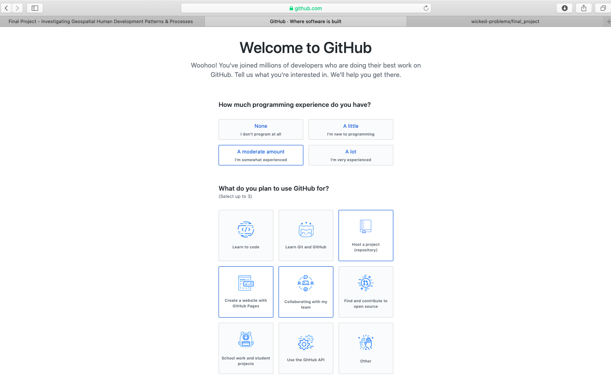

After creating your account, you should receive an e-mail asking to verify your account.  Go ahead and verify, so GitHub can permit you to create a new repository.  Once you verify your e-mail address, GitHub will likely ask if you want to create a new repository.  If somehow you are not automatically asked to create a new repository, it is also possible by selecting the + pull down arrow in the top right corner of the page.

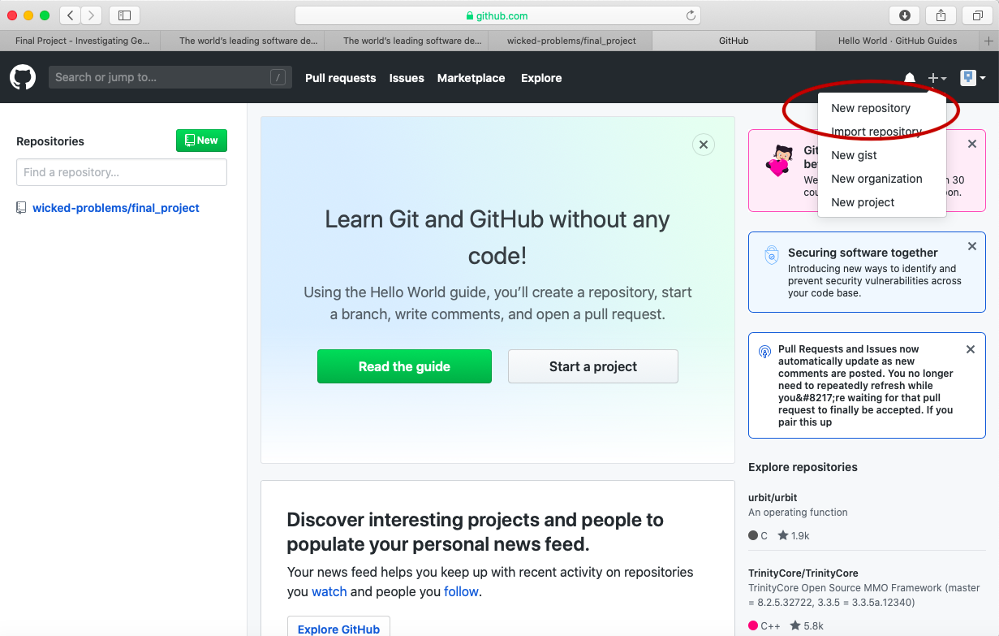

You will also notice that there is a guide made available for new users \(the green, read the guide tab\).  This is really good guide to read, in order to learn how to use GitHub as a version control system.  Although you will be using only a small amount of GitHub's full potential for this final project, I highly recommend making a mental note of the guide and returning to the 10 minute read when you have some time.  If you are planning to major or minor in data science, computer science, or any discipline that has a signficiant compuational component, it will be very likely that at some point in the future you will need to use a version control system \(such as GitHub\) for repository control, sharing, collaboration, conflict resolution etc...[https://guides.github.com/activities/hello-world/](https://guides.github.com/activities/hello-world/)

Create your first repository.  In the following example I have named my repository `workshop`.

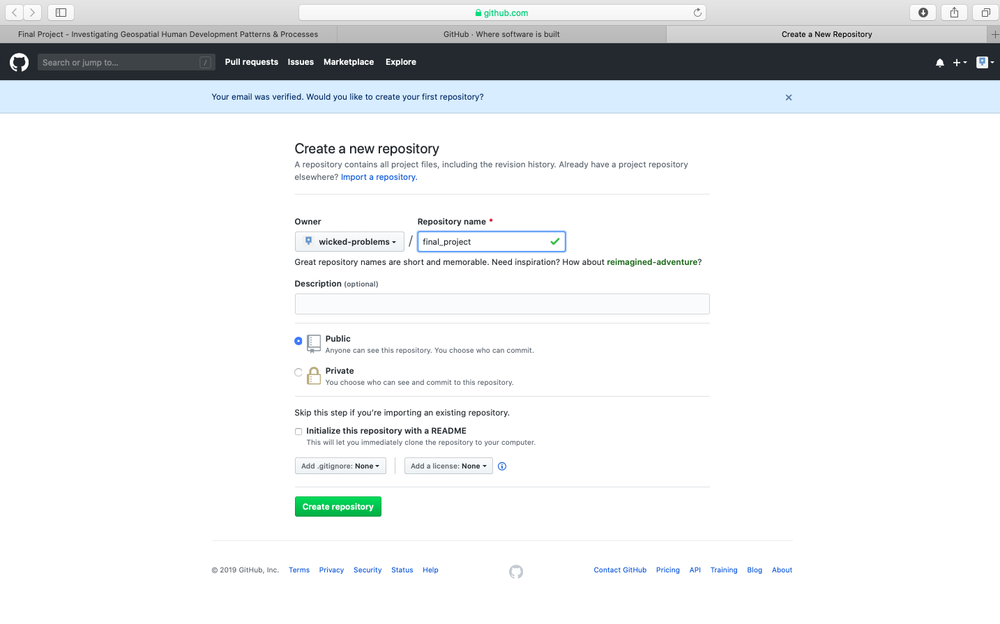

After creating your repository, go to the main page for your repository.  You should see a quick setup script under the `code` tab.  Click on `create a new file` under the quick set-up at the top of the page in order to populate your newly created repository with a file named `README.md`.  The `.md` extension after the filename is the extension for a markdown file.  Markdown is a simple, plain text, formatting, syntax language which has as its main design goal, as-is readability.   It is a relatively simple language that will enable you to program webpage content fairly easily. 

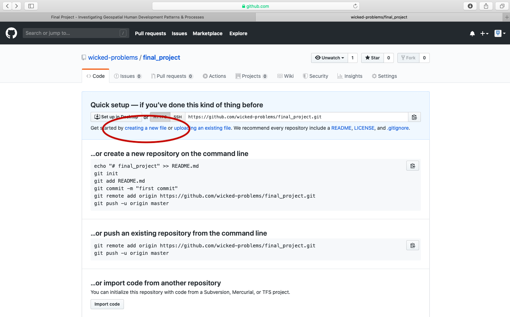

This should bring you to a new page where you are able to create a new file.  In order for your GitHub Pages site to function properly, you will need a `README.md` file in the root folder of your repository.  Below the field for the file name is the markdown file body, where you will type your script.  Add a first level `header` to your `README.md` file by adding one `#` and following it with your title.  

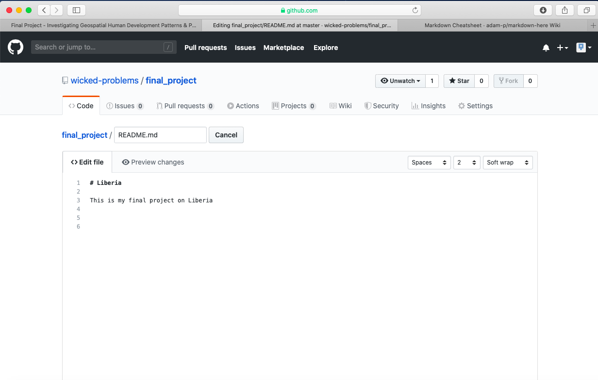

You can also preview the output from your markdown file, by clicking on the preview changes tab.

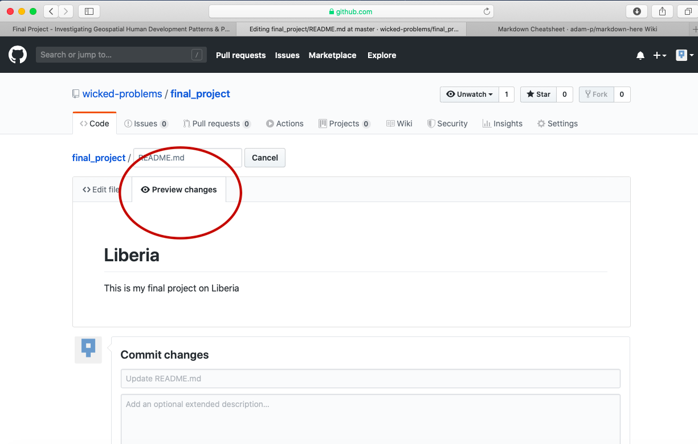

After typing the simple markdown script, scroll to the bottom of the page and click on the green commit button, to commit your file to your repository.  You will need to press this green button, each time you edit the content within a file or add new files to your repository.  By making a new commit to your repository, you are essentially updating all of the changes you had previously made.  While in the case of your final project, there is essentially only one person executing changes per repository, potentially a version control system has the power of resolving conflicts amongst multiple persons all committing changes to the same file simultaneously.  That is the power of a version control system, such as GitHub.

To begin getting an understanding of how to use markdown, have a look at the following cheatsheet.  The two main areas to note are how to use **headers** and then a bit further down in the cheatsheet, how to produce **tables**.



For the final project, you will only be using headers, paragraph text and inserting images.  After having a look at the markdown cheatsheet, return to the main page of your repository, which should appear similar to the following image.  After navigating to that location, click on the `settings` tab in the top right hand corner.

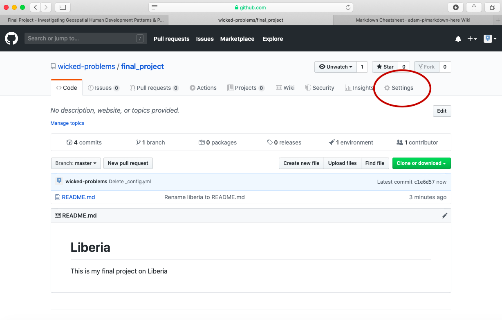

Scroll down to the **GitHub Pages** section under `settings` and change the page source from `none` to `master_branch`.

After setting the branch where your **GitHub Pages** files will reside, also select the theme tab and choose one of the available themes.  I chose the theme `Caymen` for my page, but you are welcome to select any of the available themes for your final project.  After, selecting your theme and returning to the **GitHub Pages** section, you should notice a web address appear where your site has been published.  It might take a few moments for your webpage to appear, but not more than 10 or 15 seconds.  Usually it updates and publishes almost immediately.

After clicking on the link, the newly created webpage that you will use to publish the results from your investigation should appear.  To start making changes to your website, go back to the main page of your repository and select the **upload files** tab.

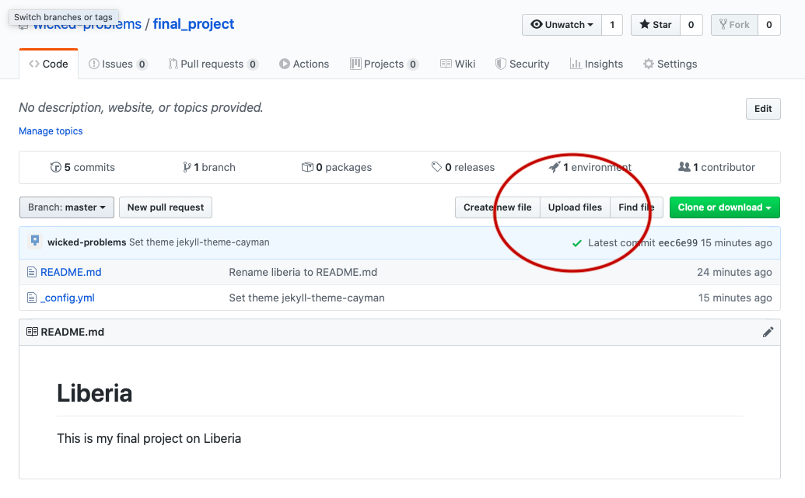

This should bring you to a page that will enable you to upload the images you have produced from each of the previous projects.  The interface should appear similar to the following image.  You can simply drag and drop images directly through the GitHub **upload files** interface.

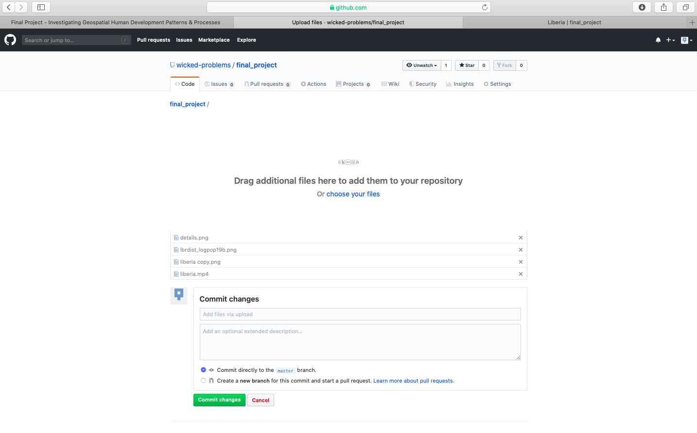

I will begin by dragging and dropping a few of the plots produced that describe the administrative subdivisions of Liberia as well as the spatial distribution of it's population.

After dropping the files into my repository, the basic file structure appears as follows.

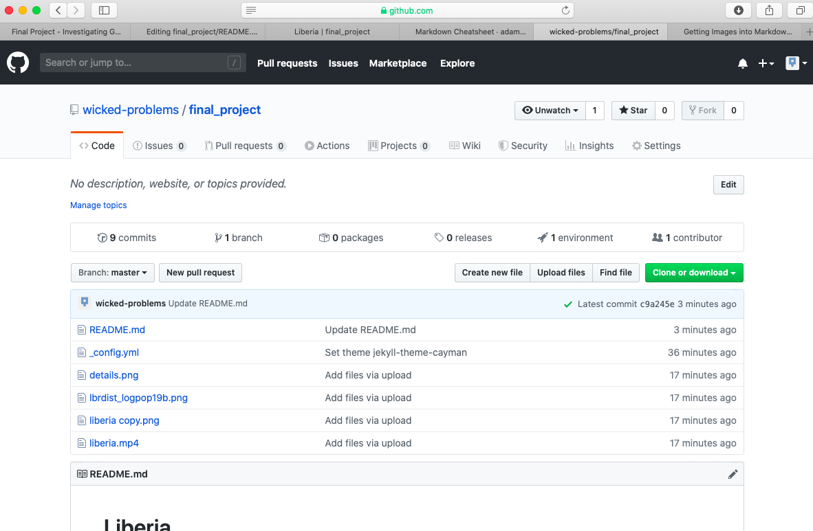

To add the image `details.png` to your `README.md` file, first select the `README.md` file, and then select the pen image in the upper right hand side of the screen to begin editing the content you already saved to your markdown file.

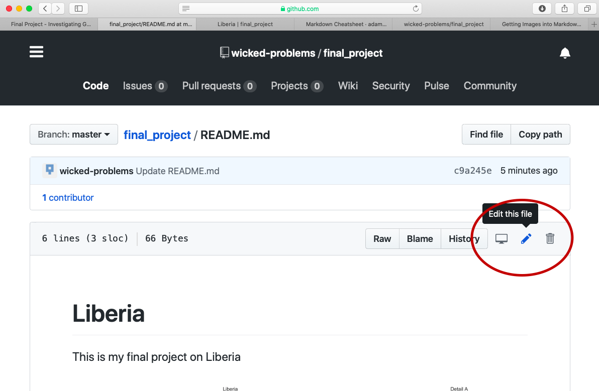

After opening up the markdown file editor, add a second level header by preceding the text with two `##` and then add your image by adding a `![]` in advance of the file name `details.png` , which is contained within `()` .  Don't forget to scroll down to the bottom of the page and click on the **commit** button to make sure the changes you have made to the file are properly committed to the repository.  If you do not commit your changes to your repository, your file will not have been saved nor will your webpage updates be published.

After committing the changes and waiting a few moments, your changes will appear to the published webpage.

After adding your map that describes the political subdivisions of your LMIC, also add your description of population as spatially distributed at different adm levels.

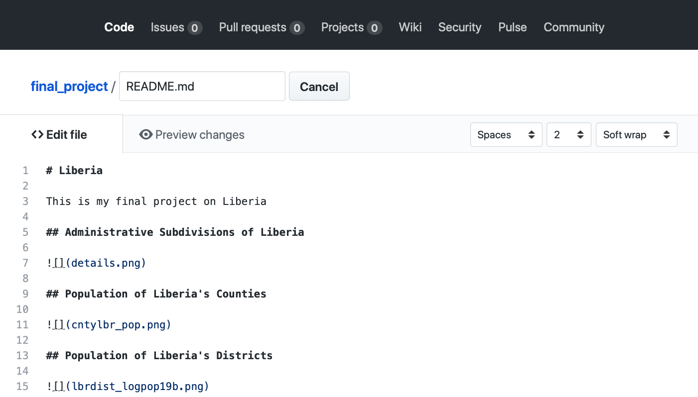

If you created an animated video, such as a `.mp4` file that rotates and describes population in three dimensions, you will need to convert that file to a `.gif` in order to include it in your project webpage.  This is fairly easily accomplished by using an online conversion tool.  I simply entered "_online conversion of mp4 to gif mac_" into google, and the search engine returned several possible options, such as [https://ezgif.com/video-to-gif](https://ezgif.com/video-to-gif), among many others.  After converting your `.mp4` to a `.gif` , upload the file to your repository and include it as an image in your markdown file, just like the other images.

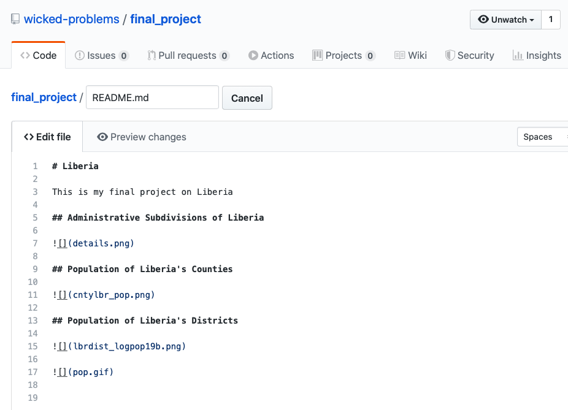

Which will produce the following image as part of your webpage.



Now continue to populate your newly created GitHub Pages site, using markdown and your `README.md` file.  There are a multitude of different structural approaches you could take to creating your webpage, such as creating different markdown files and providing links to each, but in the most basic form, you can simply use the `README.md` file to produce your final project.
