Regress the data from two variables against each other and examine the coorelationship that is being described by the two variables.  Use the `geom_point()` command to add the points for your two variables as well as the `geom_smooth()` command to add the regression line \(as well as the confidence interval\).

```r
ggplot(lbr_adm2, aes(pop19, ntl)) + 
  geom_point(size = .1, color = "red") +
  geom_smooth()
```

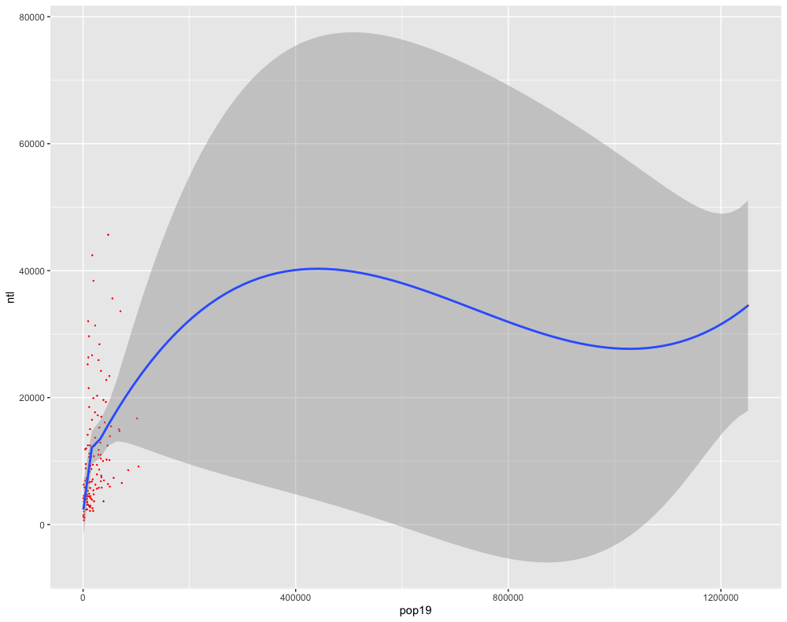

Estimate the parameters of your model using the `lm()` command and then return a `summary()` to find out more information regarding the model's fit and capacity to explain the coorelationship between your two selected variables.

```r
fit <- lm(pop19 ~ ntl, data=lbr_adm2)
summary(fit)
```


Add a few more variables to the `lm()` command.  For example in the following plot I have estimated a regression model where the population of Liberia in 2019 is the dependent variable \(response\), while night time lights \(`ntl`\), urban cover \(`dst190`\), and bare cover \(`dst200`\) are the independent variables \(predictors\).

```r
ggplot(lm(pop19 ~ ntl + dst190 + dst200, data=lbr_adm2)) + 
  geom_point(aes(x=.fitted, y=.resid), size = .1) +
  geom_smooth(aes(x=.fitted, y=.resid))
```


Again estimate the model and check the fit.

```r
fit <- lm(pop19 ~ ntl + dst190 + dst200, data=lbr_adm2)
summary(fit)
```

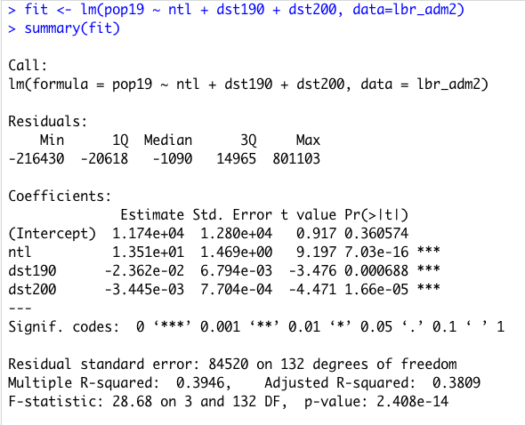

Finally, add all of the variables to your regression model.  Compare the results.

```r
ggplot(lm(pop19 ~ water + dst011 + dst040 + dst130 + dst140 + dst150 + dst160 + dst190 + dst200 + topo + slope + ntl, data=lbr_adm2)) + 
  geom_point(aes(x=.fitted, y=.resid), size = .1) +
  geom_smooth(aes(x=.fitted, y=.resid))
```

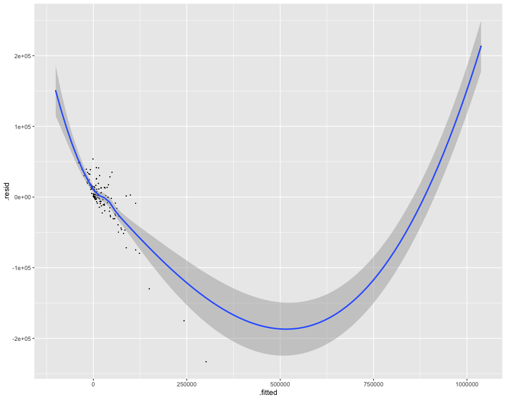

```r
fit <- lm(pop19 ~ water + dst011 + dst040 + dst130 + dst140 + dst150 + dst160 + dst190 + dst200 + topo + slope + ntl, data=lbr_adm2)
summary(fit)
```


## Team Challenge Question

Also use `ggplot()` to plot **two linear models**.  Use the `fit()` and `summary()` commands to describe your models.  Are you able to definitively identify coorelation between population and any of the other or combination of other land use and land cover geospatial covariates?  How about density?

Meet with your group and prepare four different plots from at least three different countries \(or team members\) for the Friday informal group presentation.  Then as a group, upload all 5 team members plots to \#data100\_igps \(informal group presentations\) by Sunday night.  Each member should upload at least **two combined histogram / density plots** as well as **two linear model plots**.

## Individual Stretch Goal 1

Manually recreate the `ggplot()` model of your regression from above.  First identify the `fitted.values` as a variable in the model you named `fit.`  Use the `$` operator to identify the variable within the model object and return all of the values.

```r
name_of_model$variable.with.fitted.values
```

Send this `object$variable` directly to the console and review the results.  You should have the same number of fitted values as subdivisions within your adm2.  Each individual fitted value is calculated by multiplying each variables' estimate \(or coefficient\) by the actual value for that observation \(or row\) and then summating the total of those products.

Likewise, manually calculate each individual model residual by subtracting all of the values for the dependent or response variable, `pop19`, from each cooresponding calculated, fitted value.  The difference of these two outcomes are the model residuals.

```r
your_adm2$pop19 - name_of_model$variable.with.fitted.values
```

Plot the two variables as a `ggplot` object.  First create a `data.frame` using the `cbind.data.frame()` command.  Name each of the new columns within your data frame accordingly.

```r
model_data <- cbind.data.frame(fitted = name_of_model$variable.with.fitted.values, residuals = your_adm2$pop19 - name_of_model$variable.with.fitted.values)
```

Use `ggplot()` to plot your model.

```r
ggplot(data = you_data_frame, aes(x = variable, y = variable)) +
  geom_point(size = 0.25) +
  geom_smooth(size = 0.5)
```


The three observations beneath the curve before it begins to rise seem to evidence the final contributions to the model before it transitions towards the observation for Monrovia.  Add labels to these four points, by using the `subset()` command and creating a new object that you will use to annotate each of those four observations.

```r
text <- subset(model_data, fitted > add_value_here)
```

Use this new object to plot the names of these four observations from the data.

```r
ggplot(data = your_data, aes(x = variable, y = variable)) +
  geom_point(size = 0.25) +
  geom_smooth(size = 0.5) +
  geom_text(data = your_data,
            aes(x = variable,
                y = variable,
                label = name),
            size = 2,
            nudge_y = value)
```

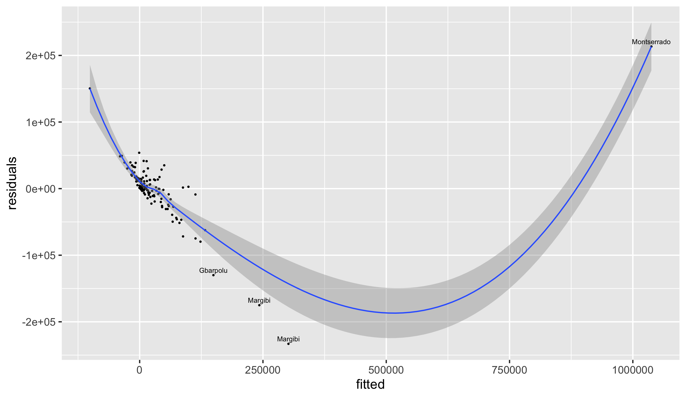

Likewise manually calculate residual standard error.

```r
#How to calculate Residual Standard error (Like Standard Deviation)
k <- length(fit$coefficients)-1 #Subtract one to ignore intercept
SSE <- sum(fit$residuals^2)
n <- length(fit$residuals)
#Residual Standard Error
sqrt(SSE/(n-(1+k)))
```

Also, manually calculate multiple R^2.

```text
#Multiple R-Squared (Coefficient of Determination)
SSyy <- sum((lbr_adm2$pop19 - mean(lbr_adm2$pop19))^2)
SSE <- sum(fit$residuals^2)
(SSyy-SSE)/SSyy
#Alternatively
1-SSE/SSyy
```

Calculate adjusted R^2.

```r
#Adjusted R-Squared
n <- length(lbr_adm2$pop19)
k <- length(fit$coefficients)-1
SSE <- sum(fit$residuals^2)
SSyy = sum((lbr_adm2$pop19 - mean(lbr_adm2$pop19))^2)
1-(SSE/SSyy)*(n-1)/(n-(k+1))
```

Calculate the F-statistic.

```r
#F-Statistic
((SSyy-SSE)/k) / (SSE/(n-(k+1)))
```

Finally, manually add the adjusted R^2 and F-statistic as labels to your plot.

```r
ggplot(data = model_data, aes(x = fitted, y = residuals)) +
  geom_point(size = 0.25) +
  geom_smooth(size = 0.5) +
  geom_text(data = text,
            aes(x = fitted,
                y = residuals,
                label = adm1),
            size = 2,
            nudge_y = 7500) +
  geom_text(aes(x = 500000,
                y = 25000,
                label = "Adjusted R-Squared")) +
  geom_text(aes(x = 500000,
                y = 0,
                label = round(as.numeric(summary(fit)[9]), 4))) +
  geom_text(aes(x = 500000,
                y = -40000,
                label = "F-statistic")) +
  geom_text(aes(x = 500000,
                y = -65000,
                label = round(as.numeric(summary(fit)[[10]][1]), 4)))
```


# Modeling & Predicting Spatial Values

In this lab, you will use the model parameters your previously estimated in order to predict spatial values across the landscape of your selected LMIC.  To do this create a new script, install and load needed packages and libraries, and set your working directory.  Once you have your script set up with `sf::` , `raster::`, `tidyverse::`, `doParallel::`, and `snow::` all in place, again load your `RasterStack` into your RStudio workspace.  I named my 12 layer `RasterStack` that describes land use and land cover throughout Liberia, `lulc`, and just as before it displays the following summary characteristics.

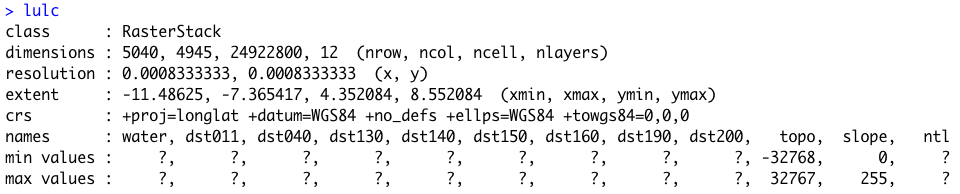

Also, load the `adm0` \(or international boundary\), `adm1` and `adm2` for your LMIC.  If you don't have your international boundary, go back to GADM, HDX or also look on Geoboundaries for the shapefile in order to import to your RStudio work session.







For this exercise, I will retrieve my international border shapefile from the Geoboundaries subdirectory and then use the `read_sf()` command to import the data as an object I named `lbr_int`.

You will also need the WorldPop raster later in the exercise in order to calculate a basic estimate of spatial error.  To improve upon the predictive capability of the model, I have gone back and retrieved the 2015 WorldPop raster file of persons per pixel \(ppp\) for Liberia, rather than the 2019 population counts we previously used.  It is probably not going to have a huge impact, but if you want to try for the best results, the date value of your response variable should be the same as the date value of your geospatial covariates.

```r
lbr_pop15 <- raster("lbr_ppp_2015.tif")
```

You may have noticed when reviewing the characteristics of your `RasterStack` that many of the layers had `?` as the value for both the `min values` and `max values`.  The reason this occurred is because each of the layers within the `raster` is presenting values outside of the boundaries of our LMIC.  For example, with Liberia, you will notice that there is a large portion of the area within the plot but outside of the national border that has some assigned value \(likely `NA`\).  These values are not part of our analytical area and should be omitted.  In order to fix this problem, we need to use the `mask()` command to remove all of the gridcells that are not explicitly within the international border of our LMIC.

```r
yourRasterStack <- add_command_here(yourRasterStack, yourLMIC_intlborder)
```

It might take a few minutes to run the `mask()` command.  On a MBAir using the `mask()` command on a 12 layer `RasterStack` \(each layer having about 25 million gridcells\) it takes about 10 minutes.  Once the command is completed, you should now notice `min values` and `max values` when retrieving a summary of what has now been transformed from a `RasterStack` to a `RasterBrick`.

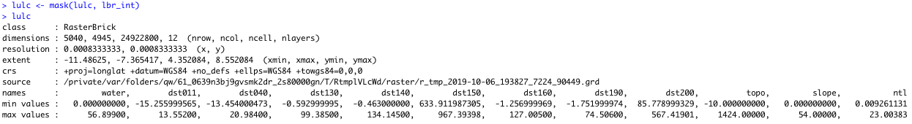

As in the previous exercise, estimate your linear model using the `pop15` variable as your response \(dependent variable\) and all of the covariates from your `adm2` sf object as the predictors \(independent variables\).

```r
model <- add_command_here(depvar ~  ind1 + ... + indN, data=your_adm2_sf)
```

Once you have estimated your model, use the `summary()` command to review a summary of its characteristics.

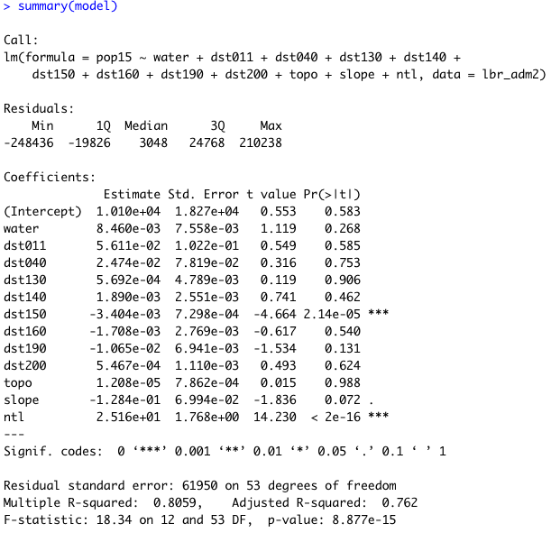

Confirm that each variable in your `lulc` object has a corresponding variable in the linear model you just estimated.  You will use these estimates with the 12 different geospatial coverariate layers within your `RasterBrick` to predict the population at each gridcell across your LMIC.  Use the `predict()` function from the `raster::` package with your `lulc` object as well as your `model` to predict the population value of every gridcell within the borders of your LMIC.

```r
predicted_values <- library::function(RasterBrick, your_model, progress="window")
```

Adding the `progress="window"` argument at the end of the command should force a progress window to appear on main desktop that informs you of how many steps are needed to completely execute the command as well as how many have been completed.  The `progress="window"` argument is purely optional.

The resulting object `predicted_values` should be a single `RasterLayer` with the same number of gridcells as each layer within your `RasterBrick`.   Type the name of the `RasterLayer` into the console to review its summary output, while also noting the minimum and maximum values across all gridcells.

Use the `cellStats(predicted_values, sum)` command to calculate the sum of all the values in every gridcell throughout your newly created `RasterLayer`.  With the model estimated for Liberia, the sum total of all predicted values is `113413402375`\(113 billion\).  Compared with the output from `sum(your_adm2$pop15)` \(which is `4039128`for Liberia\) your will very likely that your model has massively overestimated population values \(in this case by an order of about 28,000 times\).

While these predicted values are no where near the real population count at each gridcell, they do nonetheless provide a spatial description of the proportion of persons as distributed across the landscape of your LMIC.  In fact, if we execute some basic raster algebra and subtract the minimium value from my `predicted_values` `RasterLayer` and then sum the values of all gridcells, we will find that while the total population predicted is still very likely a gross overestimation, it is getting closer to our best estimate of the real value \(in the case of Liberia, now an order of 15 times `pop15`\).

```r
base <- predicted_values - minValue(predicted_values)
cellStats(base, sum) 
```

We will proceed with the `RasterLayer` by using the `extract()`command to assign the ID from each `adm2` object to each gridcell containing a predicted value from our linear model using the `lulc` geospatial covariates as indenpendent variables.  To effectively use the `extract()` command, set `ncores` object to one less than your total and then also execute the `beginCluster()` command as you have done in previous exercises.  In this case, since it is only one layer, the extract command should take less time to execute \(about 10 to 15 minutes on an MBAir\).

```r
ncores <- detectCores() - 1
beginCluster(ncores)
pred_vals_adm2 <- raster::extract(your_pred_vals_raster, your_adm2, df=TRUE)
endCluster()
```

Once you have assigned the `ID` to each gridcell according to its `adm2` location, aggregate the values.  This time we will use a slightly different command to sum the values by `adm2` unit, although either way could work.  Also, bind this new column to your `adm2` `sf` object.

```r
pred_ttls_adm2 <- aggregate(. ~ ID, pred_vals_adm2, sum)
lbr_adm2 <- bind_cols(lbr_adm2, pred_ttls_adm2)
```

Your `sf` object now has a new column named `layer` that has the sum of all predicted values for each `adm2` subdivision of the LMIC.  Assign the value for `layer` to each gridcell according to its `adm2` subdivision.  Use the `rasterize()` command with your `adm2` object and your `predicted_values` raster in order to create a new `raster` that has the predicted totals of every `adm2` assigned to each gridcell according to its location.  The `raster` object used in the argument \(in this case `predicted_values`\) is the base template for the new raster produced as a result of the command. 

```r
new_raster <- command(adm2, template_raster, field = "layer")
```

Create a new raster that represents each gridcells proportion of the total within its `adm2` subdivision.

```r
another_new_raster  <- raster_1 / raster_2
```

Again use the `rasterize()` command to assign a value to every gridcell according to its `adm2` location, but this time use the `pop15` variable.

```r
yet_another_new_raster <- command(adm2, template_raster, field = "pop15")
```

Distribute the `adm2` populatoin totals across each gridcell according to its fractional proportion of summed predicted population \(also at `adm2`\), multiply the proportion by the totals.

```text
population <- gridcell_proportions * population_adm2
```

Confirm your results by evaluating the totals.

```text
cellStats(population, sum)

[1] 4039128
```

R should return the same total previously used when you calcualte `sum(your_adm2$pop15)`.


## Investigate Margins of Error

Our model is serving to allocate population totals across all gridcells, but how accurate is it?  To start we can calculate the different of our predicted values - the worldpop values and sum the totals.

```text
diff <- population - lbr_pop15
```

In order to establish a basis for comparing total error across your LMIC take the absolute value of the differences and sum them to arrive a term that represnts total error.

```text
cellStats(abs(diff), sum)
```

Taking the `hist(diff)` will also inform you of the magnitude and direction of error in your predicted values.  Use the `plot(diff)` command to have a look at the resulting raster.


By looking at the histogram and the above difference of predicted value from worldpop raster it appears that most of the error is slightly above or below 0, and is also distributed fairly evenly across the entire space.  Looking closely though, the area close to the southwest coast appears to exhibit a different phenomenon.  This is the capital of Liberia, Monrovia.  For your investigation, select the primary urban area and conduct the same analysis as follows.

First subset your `adm2` by using the name of the administrative subdivision.

```text
new_name <- your_adm2 %>%
  filter(name_var == "Add Name Here")
```

Use the `mask()` command with this newly created `sf` object to focus your analysis on the primate city within your LMIC.

```text
urban_diff <- mask(diff, urban_adm2)
urban_pop <- mask(population, urban_adm2)
```

Create an object the defines the boundaries of your identified urban area.  The bounding box used in your `crop()` command should be defined according the following order.

```text
c(western_most_longitude, eastern_most_longitude, southern_most_latitude, northern_most_latitude)
```

Following is the bounding box and `crop()` command used for Monrovia, Liberia.

```text
extGMN <- c(-10.83, -10.64, 6.20, 6.42)
gmonrovia_diff <- crop(gmonrovia_diff, extGMN)
gmonrovia_pop <- crop(gmonrovia_pop, extGMN)
```

Plot your Monrovia rasters.


Finally, plot a three dimension map of the values, to gauge exactly how much variation was exhibited in the predicted values.  Install and load the `rgl::` and `rasterVis::` libraries in order to execute the following command.

```text
rasterVis::plot3D(gmonrovia_pop)
```

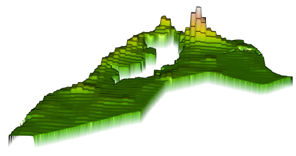

Finally, add the `tmap::` library and overlay your differences plot.

```r
mapview::mapview(gmonrovia_diff, alpha = .5)
```

Do you identify a geospatial trend associated with the error resulting from your predicted values?


## Team Challenge Question

Follow the steps from above used to produce the plots describing Liberia, but instead each team member should use their own selected LMIC country.  Investigate the results from your model at different scales and locations across your selected LMIC.  How effective was your model?  Do you identify any trends?  Produce a variety of plots that investigate, describe and analyze your dasymmetric population allocation using a linear model with land use and land cover geospatial covariates.  Investigate at least two different locations and two different scales.  Use adm1, adm2 or adm3 units of analysis, either in combination or alone to define the boundaries of your analysis.

Meet with your group and prepare to present three different plots from at least three different countries \(or team members\) for the Friday informal group presentation.  You are welcome to combine output from the previous Project 2 exercise \(part 1\) as you wish.  Then as a group, upload all 5 team members plots to \#data100\_igps \(informal group presentations\) by Sunday night.  Each member should upload at least **four plots** that describe **at least two different locations of differing scales** within your LMIC.

# Investigating and Comparing Results

Load all of your covariates, import your adm0 \(international boundary\) to `crop()` and `mask()` your `RasterBrick` and then use `writeRaster()` to save it.  Later, use the `brick()` function to import your `RasterBrick` to your RStudio work session as needed.  Make sure the layers in your `RasterBrick` are named after using the `brick()` command.  Use the `names()` command to name your layers.

```r
f <- list.files(pattern="lbr_esaccilc_dst", recursive=TRUE)
lulc <- stack(lapply(f, function(i) raster(i, band=1)))
nms <- sub("_100m_2015.tif", "", sub("lbr_esaccilc_", "", f))
names(lulc) <- nms
topo <- raster("lbr_srtm_topo_100m.tif")
slope <- raster("lbr_srtm_slope_100m.tif")
ntl <- raster("lbr_viirs_100m_2015.tif")
lulc <- addLayer(lulc, topo, slope, ntl)
names(lulc)[c(1,10:12)] <- c("water","topo","slope", "ntl")

lbr_adm0  <- read_sf("gadm36_LBR_0.shp")

lulc <- crop(lulc, lbr_adm0)
lulc <- mask(lulc, lbr_adm0)

writeRaster(lulc, filename = "lulc.tif", overwrite = TRUE)
# lulc <- stack("lulc.tif")
lulc <- brick("lulc.tif")

names(lulc) <- c("water", "dst011" , "dst040", "dst130", "dst140", "dst150", 
                 "dst160", "dst190", "dst200", "topo", "slope", "ntl")
```

Obtain the 2015 WorldPop persons per pixel file for your LMIC.  Make sure your adm `sf` object has the total population per subdivision as well as its area and density.  Summarize all twelve geospatial covariates in adm groups by `sum` and by `mean`.  Modify the following code to create your adm2 or adm3 object \(you only have to select one, in the following example I have selected adm3 for Liberia\).

```r
lbr_pop15 <- raster("lbr_ppp_2015.tif")
# lbr_adm1  <- read_sf("gadm36_LBR_1.shp")
# lbr_adm2  <- read_sf("gadm36_LBR_2.shp")
lbr_adm3  <- read_sf("gadm36_LBR_3.shp")

# ncores <- detectCores() - 1
# beginCluster(ncores)
# pop_vals_adm1 <- raster::extract(lbr_pop15, lbr_adm1, df = TRUE)
# pop_vals_adm2 <- raster::extract(lbr_pop15, lbr_adm2, df = TRUE)
# pop_vals_adm3 <- raster::extract(lbr_pop15, lbr_adm3, df = TRUE)
# endCluster()
# save(pop_vals_adm1, pop_vals_adm2, pop_vals_adm3, file = "lbr_pop_vals.RData")

load("lbr_pop_vals.RData")

# totals_adm1 <- pop_vals_adm1 %>%
#   group_by(ID) %>%
#   summarize(pop15 = sum(lbr_ppp_2015, na.rm = TRUE))
# 
# lbr_adm1 <- lbr_adm1 %>%
#   add_column(pop15 = totals_adm1$pop15)
# 
# lbr_adm1 <- lbr_adm1 %>%
#   mutate(area = st_area(lbr_adm1) %>%
#            set_units(km^2)) %>%
#   mutate(density = pop15 / area)

# totals_adm2 <- pop_vals_adm2 %>%
#   group_by(ID) %>%
#   summarize(pop15 = sum(lbr_ppp_2015, na.rm = TRUE))
# 
# lbr_adm2 <- lbr_adm2 %>%
#   add_column(pop15 = totals_adm2$pop15)
# 
# lbr_adm2 <- lbr_adm2 %>%
#   mutate(area = st_area(lbr_adm2) %>%
#            set_units(km^2)) %>%
#   mutate(density = pop15 / area)

totals_adm3 <- pop_vals_adm3 %>%
  group_by(ID) %>%
  summarize(pop15 = sum(lbr_ppp_2015, na.rm = TRUE))

lbr_adm3 <- lbr_adm3 %>%
  add_column(pop15 = totals_adm3$pop15)

lbr_adm3 <- lbr_adm3 %>%
  mutate(area = st_area(lbr_adm3) %>% 
           set_units(km^2)) %>%
  mutate(density = pop15 / area)

#save(lbr_adm1, lbr_adm2, lbr_adm3, file = "lbr_adms.RData")

# lulc <- brick("lulc.tif")

# names(lulc) <- c("water", "dst011" , "dst040", "dst130", "dst140", "dst150", 
#                 "dst160", "dst190", "dst200", "topo", "slope", "ntl")

# ncores <- detectCores() - 1
# beginCluster(ncores)
# lulc_vals_adm1 <- raster::extract(lulc, lbr_adm1, df = TRUE)
# lulc_vals_adm2 <- raster::extract(lulc, lbr_adm2, df = TRUE)
# lulc_vals_adm3 <- raster::extract(lulc, lbr_adm3, df = TRUE)
# endCluster()
# save(lulc_vals_adm1, lulc_vals_adm2, lulc_vals_adm3, file = "lulc_vals_adms.RData")

load("lulc_vals_adms.RData")

# lulc_ttls_adm1 <- lulc_vals_adm1 %>%
#   group_by(ID) %>%
#   summarize_all(sum, na.rm = TRUE)

# lulc_ttls_adm2 <- lulc_vals_adm2 %>%
#   group_by(ID) %>%
#   summarize_all(sum, na.rm = TRUE)

lulc_ttls_adm3 <- lulc_vals_adm3 %>%
  group_by(ID) %>%
  summarize_all(sum, na.rm = TRUE)

lulc_means_adm3 <- lulc_vals_adm3 %>%
  group_by(ID) %>%
  summarize_all(mean, na.rm = TRUE)

# lbr_adm1 <- bind_cols(lbr_adm1, lulc_ttls_adm1)
# lbr_adm2 <- bind_cols(lbr_adm2, lulc_ttls_adm2)

lbr_adm3 <- bind_cols(lbr_adm3, lulc_ttls_adm3, lulc_means_adm3)

save(lbr_adm3, file = "lbr_adm3.RData")
```

Load your geospatial covariate `RasterBrick` of land use and land cover `lulc`, your 2015 WorldPop `raster` and  your adm `sf` object.  View your adm `sf` object and notice that you now have two summary sets of columns that describe each of your twelve geospatial covariates.  The first set of columns describes the sum of all values per adm while the second set describes the mean of all values per adm.  Also notice that in the second set, each variable  has had the number 1 added to its name to differentiate it from the first series.

Use the `lm()` function to estimate three models.  First use `pop15` as the response variable and the `sum` of each geospatial covariate per adm as the predictors.  Second, again use `pop15` as the response variable but this time instead use the `mean` of each geospatial covariate per adm as the predictors.  Third, use the logarithm of 2015 population `log(pop15)` as the response and the `mean` of each geospatial covariate per adm as the predictors.  Notice I created a new variable named `logpop15` but you could just as easily have specified `log(pop15)` within the call of your model.

```r
model.sums <- lm(pop15 ~ water + dst011 + dst040 + dst130 + dst140 + dst150 + dst160 + dst190 + dst200 + topo + slope + ntl, data=lbr_adm3)
model.means <- lm(pop15 ~ water1 + dst0111 + dst0401 + dst1301 + dst1401 + dst1501 + dst1601 + dst1901 + dst2001 + topo1 + slope1 + ntl1, data=lbr_adm3)

lbr_adm3$logpop15 <- log(lbr_adm3$pop15)
model.logpop15 <- lm(logpop15 ~ water1 + dst0111 + dst0401 + dst1301 + dst1401 + dst1501 + dst1601 + dst1901 + dst2001 + topo1 + slope1 + ntl1, data=lbr_adm3)
```

Check the summary output from each model.

```r
summary(model.sums)
summary(model.means)
summary(model.logpop15)
```

Make sure the names of each layer in your `RasterBrick` matches the names of the independent variables in each of your models.  Notice how the second two models use the `mean` of each geospatial covarariate and the layer names are modified accordingly to match.

```r
names(lulc) <- c("water", "dst011" , "dst040", "dst130", "dst140", "dst150", "dst160", "dst190", "dst200", "topo", "slope", "ntl")
lulc1 <- lulc
names(lulc1) <- c("water1", "dst0111" , "dst0401", "dst1301", "dst1401", "dst1501", "dst1601", "dst1901", "dst2001", "topo1", "slope1", "ntl1")
```

Use the `predict()` function from the `raster::` package with the appropriate `RasterBrick` and `model` to predict each gridcells value.  Use the `save()` and then the `load()` command in order to reduce computation time after restarting your work session. 

```r
predicted_values_sums <- raster::predict(lulc, model.sums)
predicted_values_means <- raster::predict(lulc1, model.means)
predicted_values_logpop15 <- raster::predict(lulc1, model.logpop15)

#save(predicted_values_sums, predicted_values_means, predicted_values_logpop15, file = "predicted_values.RData")
```

Use the `extract()` function from the `raster::` package to assign the adm ID to each gridcell.  Again use the `save()` and `load()` commands to reduce computation time.

```r
ncores <- detectCores() - 1
beginCluster(ncores)
pred_vals_adm3_sums <- raster::extract(predicted_values_sums, lbr_adm3, df=TRUE)
pred_vals_adm3_means <- raster::extract(predicted_values_means, lbr_adm3, df=TRUE)
pred_vals_adm3_logpop15 <- raster::extract(predicted_values_logpop15, lbr_adm3, df=TRUE)
endCluster()

#save(pred_vals_adm3_sums, pred_vals_adm3_means, pred_vals_adm3_logpop15, file = "predicted_values_adm3s.RData")
```

Aggregate all values.

```r
pred_ttls_adm3_sums <- aggregate(. ~ ID, pred_vals_adm3_sums, sum)
pred_ttls_adm3_means <- aggregate(. ~ ID, pred_vals_adm3_means, sum)
pred_ttls_adm3_logpop15 <- aggregate(. ~ ID, pred_vals_adm3_logpop15, sum)
```

Create a new data frame that contains the aggregate sums from each model's predictions.

```r
ttls <- cbind.data.frame(preds_sums = pred_ttls_adm3_sums$layer, 
                         preds_means = pred_ttls_adm3_means$layer, 
                         resp_logpop = pred_ttls_adm3_logpop15$layer)
```

Bind the new values as columns within your adm.  Notice I assigned a name to each column.

```r
lbr_adm3 <- bind_cols(lbr_adm3, ttls)
```

Use the `rasterize()` command to create a new `RasterLayer` containing the predicted values from each of your models.  The second object in your `rasterize()` command is the raster that is used as the template to produce the new raster.  The values of the template raster are not used in the calculation, instead the values in the column of your adm `sf` object that identify the sum of predicted values from your model is used. 

```r
predicted_totals_sums <- rasterize(lbr_adm3, predicted_values_sums, field = "preds_sums")
predicted_totals_means <- rasterize(lbr_adm3, predicted_values_sums, field = "preds_means")
predicted_totals_logpop <- rasterize(lbr_adm3, predicted_values_sums, field = "resp_logpop")
```

Calculate the gridcell proportions for each result.

```r
gridcell_proportions_sums  <- predicted_values_sums / predicted_totals_sums
gridcell_proportions_means  <- predicted_values_means / predicted_totals_means
gridcell_proportions_logpop  <- predicted_values_logpop15 / predicted_totals_logpop
```

Check the `cellStats()` to confirm that the sum of each objects proportions is equal to the number of adms in your `sf` object.

```r
cellStats(gridcell_proportions_sums, sum)
cellStats(gridcell_proportions_means, sum)
cellStats(gridcell_proportions_logpop, sum)
```

Produce a raster object that contains the WorldPop values we will use as our comparison spatial data set for validation.

```r
population_adm3 <- rasterize(lbr_adm3, predicted_values_sums, field = "pop15")
```

Calculate the final predicted value for each gridcell according to the output from each of the three models.

```r
population_sums <- gridcell_proportions_sums * population_adm3
population_means <- gridcell_proportions_means * population_adm3
population_logpop <- gridcell_proportions_logpop * population_adm3
```

Check `cellStats()` to verify that total population matches the initial value used in this dasymmetric allocation.

```text
cellStats(population_sums, sum)
cellStats(population_means, sum)
cellStats(population_logpop, sum)

sum(lbr_adm3$pop15)
```

Calculate the difference between each `RasterLayer` and the WorldPop `RasterLayer`.

```r
diff_sums <- population_sums - lbr_pop15
diff_means <- population_means - lbr_pop15
diff_logpop <- population_logpop - lbr_pop15
```

Finally, produce a raster plot of each model's predicted output as well as the differences and a 3D plot to visualize the results.

```r
plot(population_sums)
plot(diff_sums)
rasterVis::plot3D(diff_sums)
cellStats(abs(diff_sums), sum)

plot(population_means)
plot(diff_means)
rasterVis::plot3D(diff_means)
cellStats(abs(diff_means), sum)

plot(population_logpop)
plot(diff_logpop)
rasterVis::plot3D(diff_logpop)
cellStats(abs(diff_logpop), sum)

plot(lbr_pop15)

rgl.snapshot("diff", fmt = "png", top = TRUE )
```


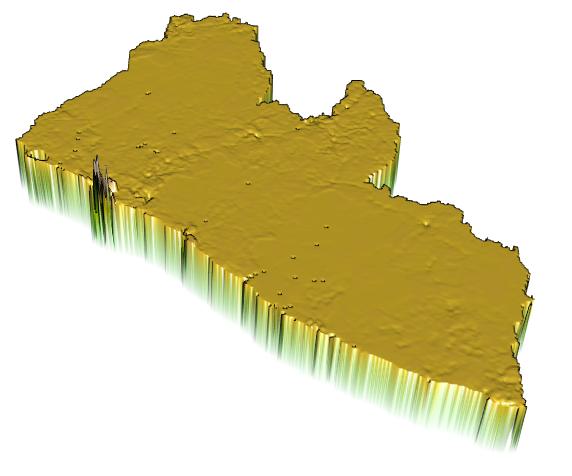

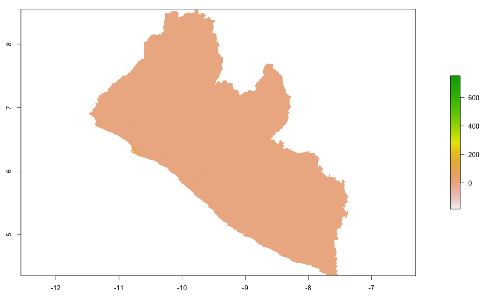


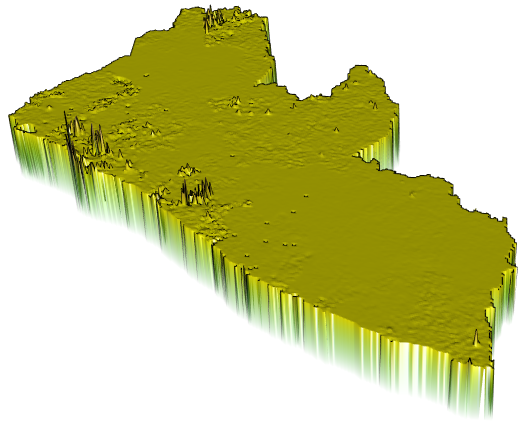


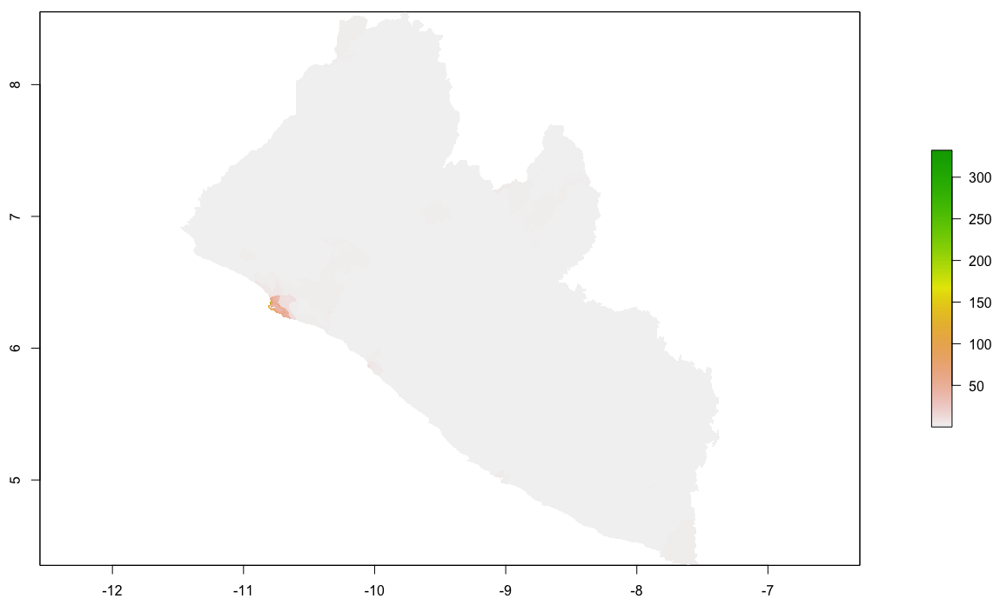

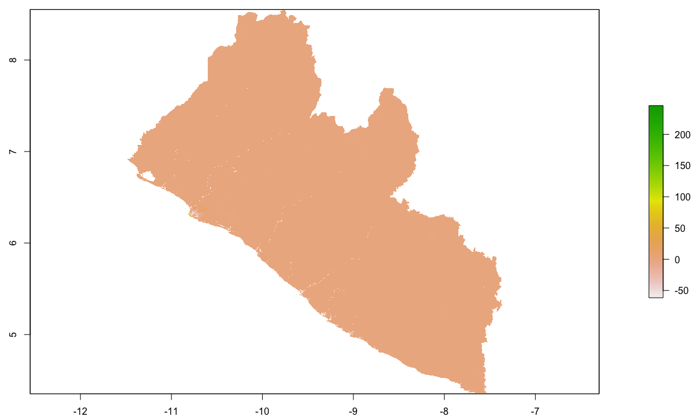

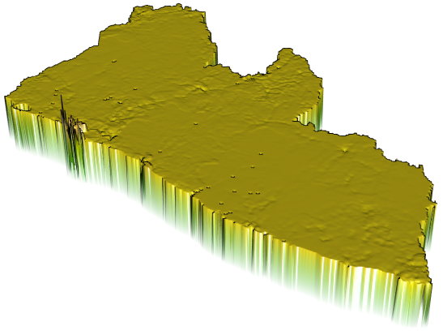

## Project 2. Individual Deliverable

Upload three sets of spatial plots that describe the predicted population of your selected LMIC using each of the three models.

1. Response variable is population and the predictors are sum of covariates
2. Response variable is population and the predictors are mean of covariates
3. Reponse variable is log of population and the predictors are mean of covariates

Each of the three sets of plots should also have three plots.

1. A plot that describes the predicted population of your LMIC using the model
2. A plot that describes the difference between your predicted results and the WorldPop estimates for 2015
3. A three dimension plot that visualizes the population or difference

Accompany your series of plots with a written statement that identifies which of the three models produced the best results.  Justify your assessment. 

Upload your deliverable to the slack channel \#data100\_project2 no later than 11:59PM on Sunday, October 20th.

## Individual Stretch Goal 1

Conduct the same analysis as above at an increased scale, analyzing one of your LMIC's largest or most significant urban areas or cities.  Subset your adm using the `%>%` operator and the `|` as needed.

```r
mts_bomi <- lbr_adm3 %>%
 filter(NAME_1 == "Montserrado" | NAME_1 == "Bomi")
```

Use the `mapview()` command to identify trends and provide further support for your assessment of each model as you did in the previous execise.

```r
mapview::mapview(gmonrovia_diff, alpha = .5)
```

Again compare the results.  Are you able to identify any trends?

## Individual Stretch Goal 2

Estimate a random forest model using the same data you previously used.  Use the mean values of all grid cells within each adm as the predictors \(independent variable\) and the log of population as the response \(dependent variable\).  Start by loading the World Pop raster you will use to validate your resuts against first.  Then load your adm0 to use in your `crop()` and `mask()` commands.  Load your adm3 that has all of your variables needed to estimate your random forest model.  Also be sure to load the land use and land cover variables you will use to predict the population of each individual grid cell.

```text
rm(list=ls(all=TRUE))

# install.packages("raster", dependencies = TRUE)
# install.packages("sf", dependencies = TRUE)
# install.packages("tidyverse", dependencies = TRUE)
# install.packages("doParallel", dependencies = TRUE)
# install.packages("snow", dependencies = TRUE)
# install.packages("randomForest", dependencies = TRUE)

#library(sp)
library(sf)
library(raster)
library(tidyverse)
library(doParallel)
library(snow)
library(randomForest)

### Import Administrative Boundaries ###

setwd("~/Tresors/teaching/project_folder/data/")

lbr_pop15 <- raster("lbr_ppp_2015.tif")

lbr_adm0  <- read_sf("gadm36_LBR_0.shp")
load("lbr_adm3.RData")

lulc <- brick("lulc.tif")

lulc <- crop(lulc, lbr_adm0)
lulc <- mask(lulc, lbr_adm0)
```

Simplify your adm3 by extracting only the needed columns.  Remove the geometry from the object by using the `st_geometry()` command and assigning it as `NULL`.  Add the log of population as a variable to your newly created data set.  Simply the class of your data set by rewriting it as a `data.frame`.  

```text
model_data <- lbr_adm3[ ,c(18:20, 35:46)]
st_geometry(model_data) <- NULL
model_data$logpop15 <- as.numeric(log(model_data$pop15))
model_data <- as.data.frame(model_data)
```

Your object `model_data` should have the following structure.

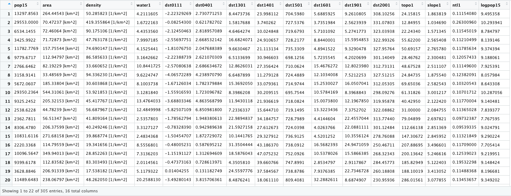

Simplify the objects you will use as the predictors and response by creating two new objects.  The `x_data` object are your predictors and coorespond to the mean values of each `lulc` variable at each adm.  The `y_data` is your response variable, in this case log of population.

```text
x_data <- model_data[ ,4:15]
y_data <- model_data[ ,16]
```

First, tune your random forest model in order to determine which of the variables are important.  The `ntreeTry =`  argument specifies how many trees the model will estimate at the tuning step.  The `mtryStart =`  argument specifies how many variables will be tried at each split.  Other arguments are also important, but you can simply follow the following chunk of code to start.

```text
init_fit <- tuneRF(x = x_data, 
                   y = y_data,
                   plot = TRUE,
                   mtryStart = length(x_data)/3,
                   ntreeTry = length(y_data)/20,
                   imrpove = 0.0001,
                   stepFactor = 1.20,
                   trace = TRUE,
                   doBest = TRUE,
                   nodesize = length(y_data)/1000,
                   na.action = na.omit,
                   importance = TRUE,
                   proximity = TRUE,
                   sampsize = min(c(length(y_data), 1000)),
                   replace = TRUE)
```

After you get a result from your tuning step, check the importance scores from your model.  Use `importance(init_fit)` to have RStudio return measures for each variable.  Assign those scores to a vector and then subset using subscripting operators all variables that have a positive value.  Retain only those variables that have a positive importance score. 

```text
importance_scores <- importance(init_fit)
pos_importance <- rownames(importance_scores)[importance_scores[ ,1] > 0]
pos_importance

x_data <- x_data[pos_importance]
```

After respecifying your random forest model, estimate it again.

```text
pop_fit <- tuneRF(x = x_data,
                  y = y_data,
                  plot = TRUE,
                  mtryStart = length(x_data)/3,
                  ntreeTry = length(y_data)/20,
                  imrpove = 0.0001,
                  stepFactor = 1.20,
                  trace = TRUE,
                  doBest = TRUE,
                  nodesize = length(y_data)/1000,
                  na.action = na.omit,
                  importance = TRUE,
                  proximity = TRUE,
                  sampsize = min(c(length(y_data), 1000)),
                  replace = TRUE)
```

Finally, use several of the parameters from `pop_fit` in the arguments of your final model.

```text
model <- randomForest(x = x_data,
                      y = y_data,
                      mtry=pop_fit$mtry,
                      ntree = pop_fit$ntree,
                      nodesize = length(y_data)/1000,
                      importance = TRUE,
                      proximity = TRUE,
                      do.trace = FALSE)
```

Check the output from your model.

```text
print(model)
plot(model)
varImpPlot(model)
```

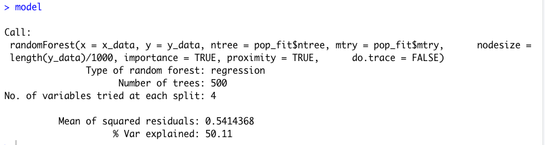

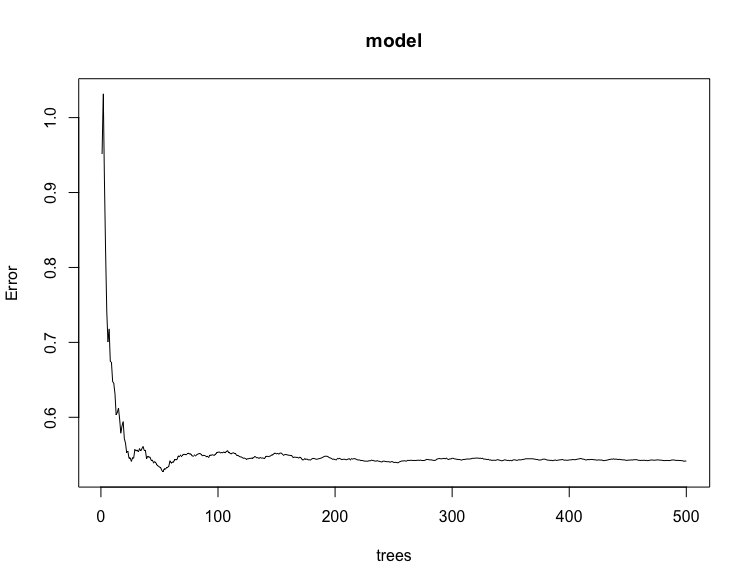

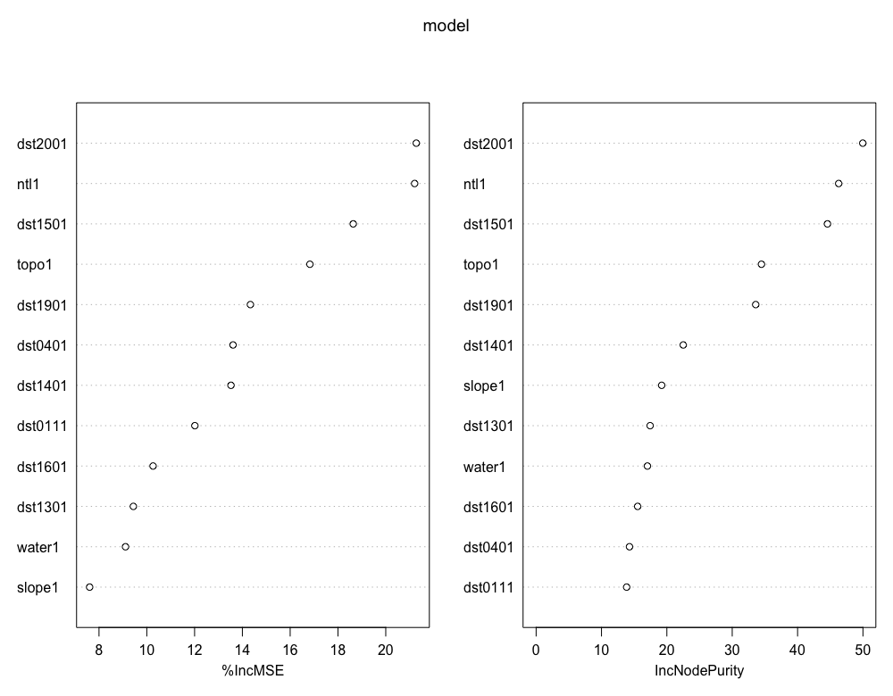

Confirm that the names in your random forest model match those found in your `rasterBrick`.

```text
names(lulc) <- c("water1", "dst0111" , "dst0401", "dst1301", "dst1401", "dst1501", "dst1601", "dst1901", "dst2001", "topo1", "slope1", "ntl1")
```

Now predict your population values using the model with the 12 different geospatial covariate layers.

```text
preds_rf <- raster::predict(lulc, model)
```

After you have predicted your population values for each gridcell, back transform the log of population to its original estimate.

```text
preds_rf_exp <- exp(preds_rf)
```

Next, extract all of the predicted values by assigning the ID for each adm unit where it is located.

```text
ncores <- detectCores() - 1
beginCluster(ncores)
preds_ttls_rf <- raster::extract(preds_rf_exp, lbr_adm3, df=TRUE)
endCluster()
```

Aggregate all of the values by adm ID and sum.

```text
preds_area_totals_rf <- aggregate(. ~ ID, preds_ttls_rf, sum)
```

Bind the columns.

```text
lbr_adm3 <- bind_cols(lbr_adm3, preds_area_totals_rf)
```

Finally, `rasterize()` the value of the total estimates per adm and then calculate the gridcell proportionate share across the entire LMIC.  Confirm that `cellStats()` returns a value equal to the number of adms in your LMIC.

```text
preds_ttls <- rasterize(lbr_adm3, preds_rf, field = "layer")
props  <- preds_rf_exp / preds_ttls
cellStats(props, sum)
```

Again, `rasterize()` population values and then multiply the gridcell proportions by the population values to estimate each gridcells proportion of the total population per gridcell.

```text
pops <- rasterize(lbr_adm3, preds_rf, field = "pop15")
gridcell_pops <- props * pops
cellStats(gridcell_pops, sum)
```

Check `cellStats()` to confirm your totals match population values calculated from the WorldPop persons per pixel raster layer.

Finally, subtract the raster layer with predicted values from your random forest model from the WorldPop ppp raster layer.  Calculate the sum of absolute value of differences between the two rasters.

```text
diff <- gridcell_pops - lbr_pop15
cellStats(abs(diff), sum)

rasterVis::plot3D(gridcell_pops)
rasterVis::plot3D(diff)
```

What can you surmise?  Have you improved your predictive power by applying a machine learning approach?


